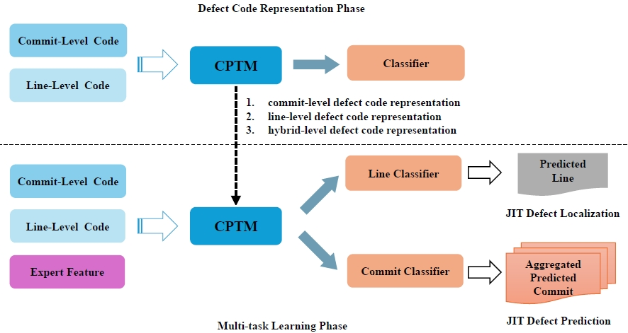

# JIT-CMT: A Multi-Task Learning Framework by Fusing Defect Code Representation and Expert Features for Just-in-Time Defect Prediction and Localization

Our Approach uses a multi-task learning framework by fusing defect code representation and expert features for JIT-DP and JIT-DL.



JIT-CMT is comprised of the following two phases:

* **Defect code representation learning** employ the CPTM to learn defect code representations of different granularity (i.e., commit-level and line-level).
* **Multi-task learning** train the same CPTM with extra expert features to identify defective commits and lines at the same time. Line-level predictions directly serve as results for JIT-DL, whereas commit-level predictions for the same commit are merged to determine the results for JIT-DP.

This repository contains the source code, datasets, checkpoints, and the guidelines for reproducing our work. The reproduction steps are as follows:

## Environment Setup
Run the following command to install the required environment.
```
conda create -n JIT-MDE python=3.8.12
conda activate JIT-MDE
pip install torch==1.9.0+cu111 torchvision==0.10.0+cu111 torchaudio==0.9.0 -f https://download.pytorch.org/whl/torch_stable.html
pip install pandas==2.0.3 transformers==4.16.2 imbalanced-learn==0.8.0
```

## Dataset
Our experiments use the [JIT-Defects4J](https://github.com/jacknichao/JIT-Fine) dataset for commit-level data, with pre-processing of line-level data from [JIT-Smart](https://github.com/JIT-A/JIT-Smart). The commit-level dataset in [`data/jitfine`](data/jitfine) folder, and the line-level dataset in [`data/jitsmart`](data/jitsmart) folder.

## Training and Evaluation
We have uploaded the best model checkpoint to [Google Drive](https://drive.google.com/drive/folders/1QfrejUYy5fS7ml82VcNRLsLs-pIgyb_I?usp=drive_link). You can directly use it to generation the prediction results as in [`output`](output) folder.

### Defect code representation learning
Run the following script in [`code`](code) folder to run line-level defect code representation learning.
```
sh run_line.sh
```

Other scripts can be referred to [`code/scripts/defect_code`](code/scripts/defect_code) folder.

### Multi-task learning

Run the following script in [`code`](code) folder to run the multi-task learning with hybrid-level defect code representation and expert features.
```
sh run_efmmt.sh
```

Other scripts can be referred to [`code/scripts/multi_task`](code/scripts/multi_task) folder.
